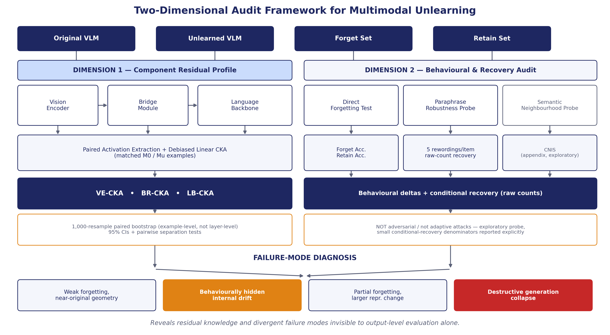
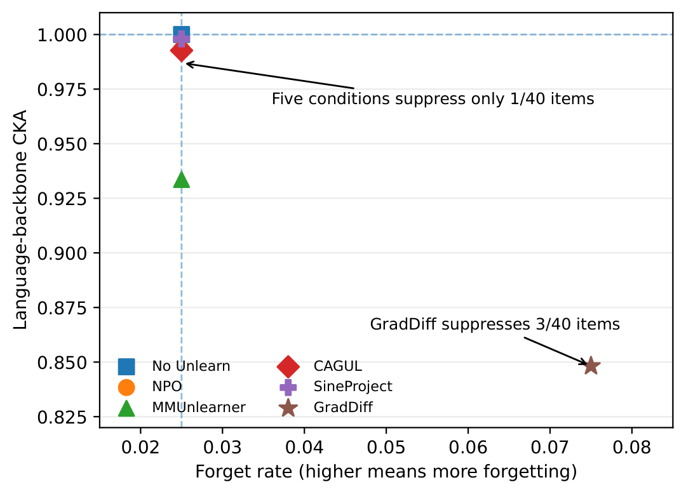
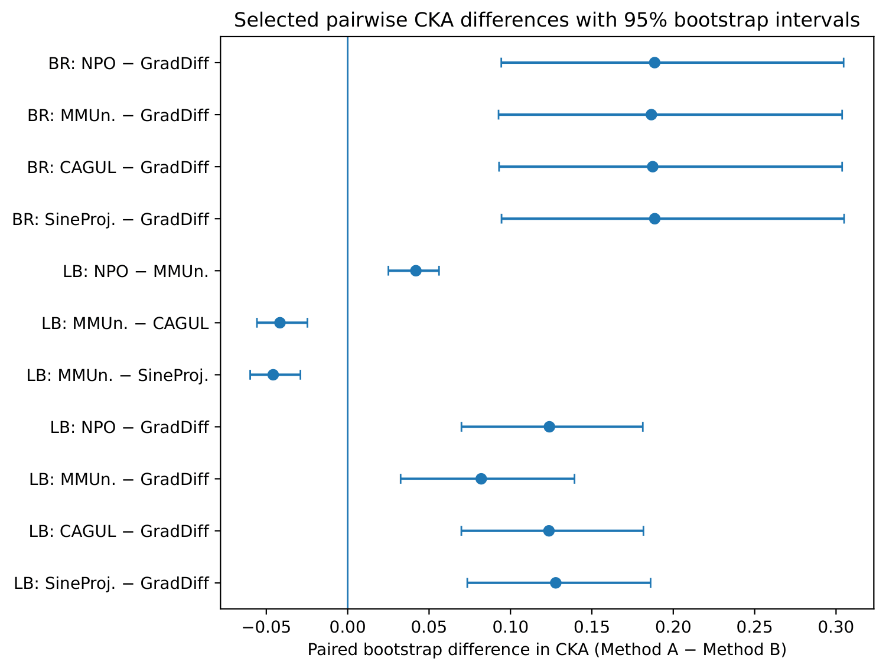
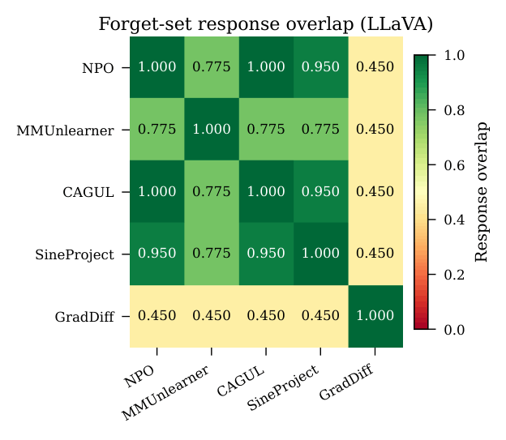
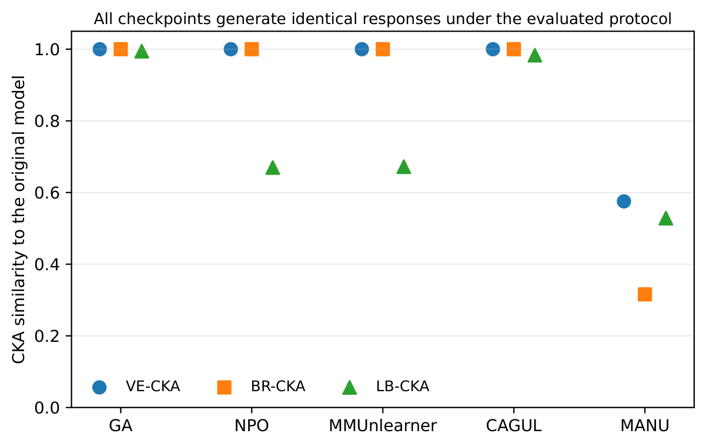
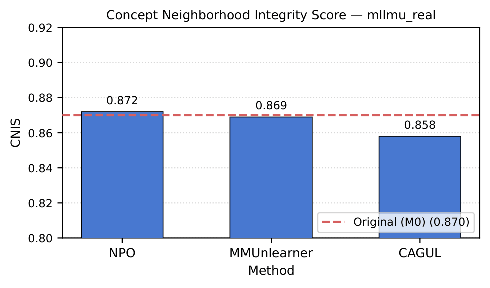
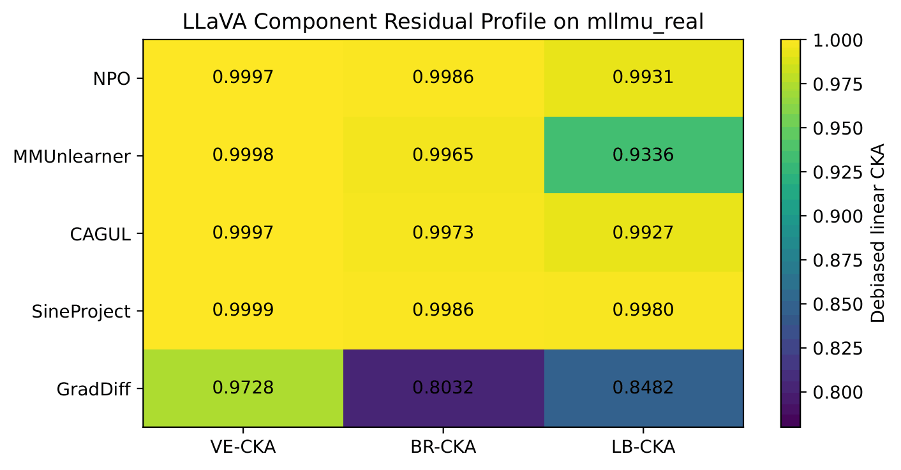

<div align="center">

# Beyond Output-Level Forgetting

## A Two-Dimensional Audit of Multimodal Machine Unlearning

[](#installation)
[](#installation)
[](#models-and-methods)
[](#audit-framework)
[](#project-status)

**Measure behaviour. Inspect likelihoods. Localize internal change.**

</div>

---

## Overview

Most multimodal machine-unlearning evaluations ask only whether the model stops producing target answers while preserving retained utility.

That is necessary, but not sufficient.

Two checkpoints can produce the same decoded answers while having very different internal representations. A method can also reduce forget accuracy because the model collapses, not because it selectively removed the target information.

**TwoDimAudit** therefore evaluates unlearning at three levels:

| Level | Question | Diagnostic |
|---|---|---|
| **Decoded output** | Did the produced answer change? | Forget and retain accuracy |
| **Likelihood** | Did support for the reference answer change? | NLL, log-probability, token rank |
| **Representation** | Where inside the VLM did the model change? | Component Residual Profile |

---

# Audit Framework

<p align="center">
  <a href="Figures/fig_framework.png">
    
  </a>
</p>

The framework combines:

- direct forget and retain evaluation;
- paraphrase recovery;
- likelihood-level auditing;
- component-wise representation analysis;
- checkpoint-integrity and collapse checks.

## Component Residual Profile

The **Component Residual Profile (CRP)** compares original and unlearned activations with debiased linear CKA across:

```text
Image
  │
  ▼
Vision encoder ──► Multimodal bridge/projector ──► Language backbone
    VE-CKA                  BR-CKA                       LB-CKA
```

High CKA means the relational geometry remains similar to the original model. Lower CKA means the model changed internally, but it does **not** by itself prove successful forgetting.

## Diagnostic taxonomy

| Behaviour | CRP | Diagnosis |
|---|---|---|
| High forget accuracy, preserved retain utility | Near-original geometry | **Under-forgetting** |
| Similar outputs | Different internal geometry | **Behaviourally hidden drift** |
| Improved forgetting, preserved utility | Moderate component-specific change | **Candidate partial forgetting** |
| Forget and retain both fail | Broad or degenerate change | **Destructive collapse** |

---

# Main LLaVA Result

<p align="center">
  <a href="Figures/fig1_scatter_fr_lb_v2.pdf">
    
  </a>
</p>

## LLaVA-1.5-7B on `mllmu_real`

| Method | F-Acc ↓ | F-Rate ↑ | Ret-Acc ↑ | VE-CKA | BR-CKA | LB-CKA |
|---|---:|---:|---:|---:|---:|---:|
| No Unlearn | 0.9750 | 0.0250 | 0.9625 | 1.0000 | 1.0000 | 1.0000 |
| NPO | 0.9750 | 0.0250 | 0.9750 | 0.9997 | 0.9986 | 0.9931 |
| MMUnlearner | 0.9750 | 0.0250 | 0.9625 | 0.9998 | 0.9965 | 0.9336 |
| CAGUL | 0.9750 | 0.0250 | 0.9625 | 0.9997 | 0.9973 | 0.9927 |
| SineProject | 0.9750 | 0.0250 | 0.9625 | 0.9999 | 0.9986 | 0.9980 |
| GradDiff | 0.9250 | 0.0750 | 0.9625 | 0.9728 | 0.8032 | 0.8482 |

### Main confidence intervals

| Method | VE-CKA 95% CI | BR-CKA 95% CI | LB-CKA 95% CI |
|---|---|---|---|
| NPO | [0.9997, 0.9999] | [0.9973, 0.9994] | [0.9926, 0.9965] |
| MMUnlearner | [0.9998, 0.9999] | [0.9937, 0.9984] | [0.9385, 0.9695] |
| CAGUL | [0.9996, 0.9999] | [0.9951, 0.9989] | [0.9918, 0.9964] |
| SineProject | [0.9999, 1.0000] | [0.9974, 0.9993] | [0.9977, 0.9990] |
| GradDiff | [0.9725, 0.9887] | [0.6928, 0.9049] | [0.8121, 0.9253] |

### Interpretation

- NPO, MMUnlearner, CAGUL and SineProject still answer 39 of 40 forget questions correctly.
- MMUnlearner has the same behavioural score as the other weak-forgetting methods, but substantially lower LB-CKA.
- GradDiff suppresses three forget answers while preserving baseline retain accuracy.
- Lower CKA is interpreted only together with forgetting and utility.

---

# Paired Bootstrap and Response Agreement

<p align="center">
  <a href="Figures/fig_pairwise_bootstrap.pdf">
    
  </a>
</p>

## Selected paired bootstrap differences

| Component | Comparison | Mean difference | 95% CI |
|---|---|---:|---|
| BR | NPO − GradDiff | 0.1886 | [0.0944, 0.3047] |
| BR | MMUnlearner − GradDiff | 0.1865 | [0.0927, 0.3037] |
| BR | CAGUL − GradDiff | 0.1874 | [0.0930, 0.3037] |
| BR | SineProject − GradDiff | 0.1886 | [0.0945, 0.3050] |
| LB | NPO − MMUnlearner | 0.0419 | [0.0250, 0.0561] |
| LB | MMUnlearner − CAGUL | -0.0416 | [-0.0557, -0.0247] |
| LB | MMUnlearner − SineProject | -0.0458 | [-0.0599, -0.0290] |
| LB | NPO − GradDiff | 0.1239 | [0.0699, 0.1813] |
| LB | MMUnlearner − GradDiff | 0.0820 | [0.0325, 0.1393] |
| LB | CAGUL − GradDiff | 0.1236 | [0.0698, 0.1817] |
| LB | SineProject − GradDiff | 0.1278 | [0.0735, 0.1861] |

Every displayed interval excludes zero.

<p align="center">
  <a href="Figures/fig3_response_overlap_heatmap.pdf">
    
  </a>
</p>

The response-overlap view complements the CRP results:

- NPO and CAGUL produce identical responses on the forget set.
- GradDiff has much lower exact-response overlap with the core methods.
- Response similarity and representation similarity are related but not interchangeable.

---

# Strength Sweep: Stronger NPO Is Not Cleaner Forgetting

## NPO strength sweep

| Configuration | F-Acc ↓ | F-Rate ↑ | Ret-Acc ↑ | Suppressed outputs | Outcome |
|---|---:|---:|---:|---:|---|
| `b0.1_s50` | 0.0000 | 1.0000 | 0.0000 | 19 | Generation collapse |
| `b0.5_s50` | 0.0500 | 0.9500 | 0.0250 | 17 | Severe retain damage |
| `b1.0_s50` | 0.4500 | 0.5500 | 0.3875 | 1 | Retain loss beyond tolerance |
| `b0.1_s100` | 0.0000 | 1.0000 | 0.0000 | 19 | Generation collapse |
| `b0.5_s100` | 0.0250 | 0.9750 | 0.0125 | 18 | Severe retain damage |

**Suppressed outputs** are refusal-like, empty or non-substantive outputs. Incorrect but substantive answers are not counted as suppression.

The sweep shows a trade-off cliff rather than a clean selective-forgetting regime.

---

# Paraphrase Recovery

## Direct-prompt suppression under rewording

| Method | Original F-Acc | Paraphrase Acc. | Recovered / Suppressed |
|---|---:|---:|---:|
| NPO | 0.9750 | 0.9700 | 1 / 1 |
| MMUnlearner | 0.9750 | 0.9700 | 1 / 1 |
| CAGUL | 0.9750 | 0.9700 | 1 / 1 |
| SineProject | 0.9750 | 0.9700 | 1 / 1 |
| GradDiff | 0.9250 | 0.8650 | 0 / 3 |

The single suppressed answer for NPO, MMUnlearner, CAGUL and SineProject recovers under rewording. None of GradDiff's three suppressed answers recover under the five tested paraphrases.

---

# Linear Probe

## Entity-disjoint L31 probe

| Checkpoint | Two-fold entity-disjoint accuracy |
|---|---:|
| No Unlearn | 1.0000 |
| NPO | 1.0000 |
| MMUnlearner | 1.0000 |
| CAGUL | 1.0000 |
| SineProject | 1.0000 |
| GradDiff | 1.0000 |

The probe remains perfect across checkpoints, showing that representational drift does not imply loss of linearly decodable entity information.

---

# BLIP-2: Identical Outputs, Different Internal States

<p align="center">
  <a href="Figures/fig_blip2_crp_v2.pdf">
    
  </a>
</p>

## BLIP-2 OPT-2.7B on `mllmu_real`

| Method | F-Acc | F-Rate | Ret-Acc | VE-CKA | BR-CKA | LB-CKA |
|---|---:|---:|---:|---:|---:|---:|
| GA | 0.4000 | 0.6000 | 0.2875 | 1.0000 | 1.0000 | 0.9945 |
| NPO | 0.4000 | 0.6000 | 0.2875 | 1.0000 | 1.0000 | 0.6699 |
| MMUnlearner | 0.4000 | 0.6000 | 0.2875 | 1.0000 | 1.0000 | 0.6721 |
| CAGUL | 0.4000 | 0.6000 | 0.2875 | 1.0000 | 1.0000 | 0.9834 |
| MANU | 0.4000 | 0.6000 | 0.2875 | 0.5753 | 0.3157 | 0.5286 |

All evaluated BLIP-2 checkpoints produce identical normalized responses on 40 forget and 80 retain examples, while LB-CKA spans **0.5286 to 0.9945**.

## Likelihood-level backfire

| Checkpoint | Forget-set mean NLL ↓ | Mean first-token rank ↓ | Decoded outputs |
|---|---:|---:|---|
| No Unlearn | 2.7787 | 699.5 | Identical across checkpoints |
| NPO | 2.6322 | 537.5 | Identical across checkpoints |

NPO makes the reference forget answers **more likely** while leaving decoded outputs unchanged. Exact-match evaluation therefore conceals a likelihood-level anti-forgetting effect.

## Prompt-occurrence breakdown

| Split | Prompt occurrence | Total | Correct | Accuracy |
|---|---:|---:|---:|---:|
| Forget | 1 | 20 | 0 | 0.000 |
| Forget | 2 | 20 | 16 | 0.800 |
| Retain | 1 | 40 | 0 | 0.000 |
| Retain | 2 | 40 | 23 | 0.575 |

---

# Cross-Dataset Validation

## UnLOK-VQA

| Method | F-Acc ↓ | Ret-Acc ↑ | Paraphrase ↓ | VE-CKA | BR-CKA | LB-CKA |
|---|---:|---:|---:|---:|---:|---:|
| GA-50 | 0.0000 | 0.0000 | 0.0000 | 0.9960 | 0.9662 | 0.7277 |
| NPO | 0.6400 | 0.8600 | 0.5870 | 1.0000 | 0.9999 | 0.9998 |
| MMUnlearner | 0.6350 | 0.8550 | 0.5768 | 0.9998 | 0.9992 | 0.9541 |
| CAGUL | 0.6425 | 0.8625 | 0.5877 | 1.0000 | 0.9999 | 0.9999 |
| SineProject | 0.6475 | 0.8625 | 0.5823 | 0.9999 | 0.9994 | 0.9992 |

GA-50 is a collapse case because forget and retain accuracy both fall to zero.

---

# Forget-versus-Retain Selectivity

## Representation selectivity

| Method | F-VE | R-VE | F-BR | R-BR | F-LB | R-LB | R-LB − F-LB |
|---|---:|---:|---:|---:|---:|---:|---:|
| NPO | 0.9997 | 0.9998 | 0.9986 | 0.9992 | 0.9931 | 0.9972 | +0.004 |
| MMUnlearner | 0.9998 | 0.9999 | 0.9965 | 0.9982 | 0.9336 | 0.9269 | -0.007 |
| CAGUL | 0.9997 | 0.9999 | 0.9973 | 0.9990 | 0.9927 | 0.9957 | +0.003 |
| SineProject | 0.9999 | 1.0000 | 0.9986 | 0.9995 | 0.9980 | 0.9991 | +0.001 |
| GA collapse | 0.9235 | 0.9605 | 0.5795 | 0.7926 | 0.5333 | 0.6318 | +0.098 |

The non-collapsed methods do not show strongly forget-concentrated language-backbone change under this aggregate summary.

---

# Layerwise and Protocol Controls

## Teacher-forced LLaVA language-backbone control

| Method | Generation LB-CKA | Teacher-forced LB-CKA |
|---|---:|---:|
| GA collapse | 0.5333 | 0.6462 |
| NPO | 0.9931 | 0.9976 |
| MMUnlearner | 0.9336 | 0.9919 |
| CAGUL | 0.9927 | 0.9971 |
| SineProject | 0.9980 | 0.9992 |

## Per-layer language-backbone CKA

| Method | L0 | L8 | L16 | L24 | L31 |
|---|---:|---:|---:|---:|---:|
| NPO | 0.9986 | 0.9982 | 0.9980 | 0.9989 | 0.9721 |
| MMUnlearner | 0.9964 | 0.9959 | 0.9958 | 0.9916 | 0.6882 |
| CAGUL | 0.9973 | 0.9967 | 0.9967 | 0.9988 | 0.9742 |
| SineProject | 0.9986 | 0.9983 | 0.9985 | 0.9994 | 0.9951 |

The strongest separation appears at L31.

## FP16 pooling sensitivity

| Pooling | VE-CKA | BR-CKA | LB-CKA |
|---|---:|---:|---:|
| Mean token | 0.9236 | 0.7156 | 0.6118 |
| Last token | 0.9095 | 0.5612 | 0.8186 |
| Absolute difference | 0.0141 | 0.1545 | 0.2069 |

## Projector-adaptation sensitivity

| Setting | VE-CKA | BR-CKA | LB-CKA |
|---|---:|---:|---:|
| Frozen projector | 0.9557 | 0.5260 | 0.4828 |
| Projector adapted | 0.9234 | 0.5000 | 0.5087 |

---

# CNIS Semantic-Neighbourhood Probe

<p align="center">
  <a href="Figures/fig_cnis.pdf">
    
  </a>
</p>

| Condition | CNIS |
|---|---:|
| Original model | 0.870 |
| NPO | 0.872 |
| MMUnlearner | 0.869 |
| CAGUL | 0.858 |

The original-model 95% bootstrap interval is **[0.803, 0.928]**. All available method means lie inside it, so CNIS is retained as an exploratory diagnostic only.

---

# CRP Heatmap

<p align="center">
  <a href="Figures/fig_crp_heatmap.pdf">
    
  </a>
</p>

The heatmap provides a compact view of which components remain close to the original model and which show larger drift.

---

# Models and Methods

## Architectures

- **LLaVA-1.5-7B**
- **BLIP-2 OPT-2.7B**

## Audited methods

- Gradient Ascent
- GradDiff
- Negative Preference Optimization
- MMUnlearner
- CAGUL
- SineProject
- MANU

Only checkpoints with validated non-zero updates and consistent provenance are included.

---

# Repository Structure

```text
2D-Audit/
├── controls/
├── evaluation/
├── models/
├── probes/
├── unlearning/
├── visualization/
├── paper_tables/
├── Figures/
├── adapter_guard.py
├── eval_behavioural.py
├── eval_recovery.py
├── stage2_save_activations.py
├── bootstrap_cluster.py
├── train_graddiff_llava.py
├── train_npo_tuned.py
├── reviewer_complete_pipeline.py
├── run_all_reviewer_fixes.ps1
├── requirements.txt
└── README.md
```

---

# Installation

```powershell
git clone https://github.com/neurips26/2D-Audit.git
cd 2D-Audit

py -m venv .venv
.\.venv\Scripts\Activate.ps1

py -m pip install --upgrade pip
py -m pip install -r requirements.txt
```

## Verify

```powershell
py -m py_compile `
  .\adapter_guard.py `
  .\eval_behavioural.py `
  .\eval_recovery.py `
  .\stage2_save_activations.py `
  .\reviewer_complete_pipeline.py
```

---

# Data and Checkpoints

Large assets are intentionally excluded:

```text
data/
checkpoints/
outputs/
```

Recommended layout:

```text
2D-Audit/
├── data/
│   ├── mllmu_real/
│   └── unlok_vqa/
├── checkpoints/
│   ├── llava_npo_adapter/
│   ├── llava_mmunlearner_adapter/
│   ├── llava_cagul_adapter/
│   ├── llava_sineproject_adapter/
│   ├── graddiff/
│   └── blip2_*/
└── outputs/
```

---

# Quick Start

```powershell
py .\eval_behavioural.py
py .\eval_recovery.py
py .\stage2_save_activations.py
py .\bootstrap_cluster.py
```

Full audit pipeline:

```powershell
powershell.exe `
  -NoProfile `
  -ExecutionPolicy Bypass `
  -File .\run_all_reviewer_fixes.ps1 `
  -Mode GPU `
  -Resume
```

Final validation:

```powershell
powershell.exe `
  -NoProfile `
  -ExecutionPolicy Bypass `
  -File .\run_all_reviewer_fixes.ps1 `
  -Mode Final
```

---

# Reproducibility

The pipeline preserves:

- matched example identifiers;
- hook and layer metadata;
- original and unlearned activation matrices;
- checkpoint identity and update validation;
- fixed bootstrap indices;
- paired replicate arrays;
- entity-cluster resampling indices;
- LOEO influence values;
- probe folds;
- per-item likelihood records;
- machine-readable CSV/JSON reports;
- automated PASS/FAIL summaries.

---

# Interpretation Rules

1. **Lower CKA is not automatically better.**
2. **Low forget accuracy can be caused by collapse.**
3. **Identical decoded outputs do not imply identical likelihoods.**
4. **Likelihood differences do not localize internal change.**
5. **Linear decodability does not prove causal storage.**
6. **CRP is diagnostic, not a deletion certificate.**
7. **All comparisons must use matched examples and one shared protocol.**

---

# Project Status

This repository is an anonymous research artifact accompanying a paper under peer review.

Included:

- core evaluation and analysis code;
- paper figures;
- manuscript-facing tables;
- checkpoint-integrity checks;
- reproducibility scripts;
- automated audit reports.

Large checkpoints, raw datasets and activation tensors are distributed separately.

---

# Ethics and Responsible Use

The audit is designed to identify ineffective, fragile or destructive unlearning.

It must not be used as the sole evidence for legal or regulatory compliance. Real-person entities are anonymized in manuscript-facing influence analysis.

Likelihood-level backfire is especially important in privacy-sensitive deployments: an intervention may leave decoded outputs unchanged while increasing support for the information that was intended to be removed.

---

# Citation

```bibtex
@misc{twodimaudit2027,
  title        = {Beyond Output-Level Forgetting:
                  A Two-Dimensional Audit of Multimodal Machine Unlearning},
  author       = {Anonymous},
  year         = {2027},
  note         = {Anonymous research artifact}
}
```

---

<div align="center">

## TwoDimAudit

**Measure behaviour. Inspect likelihoods. Localize internal change.**

</div>
